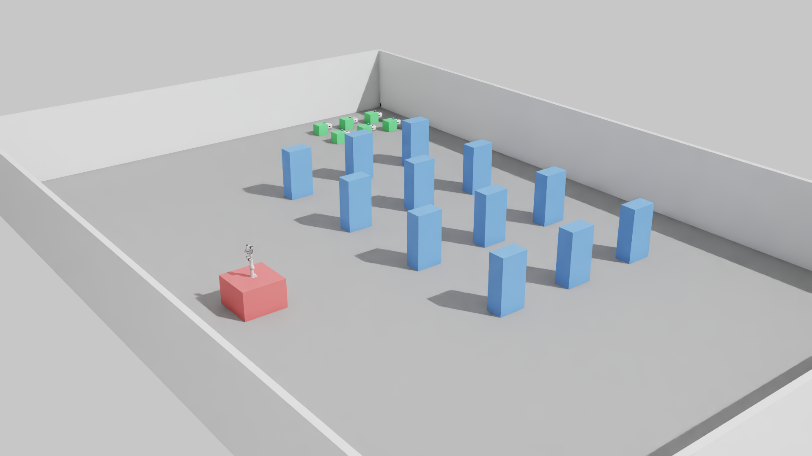
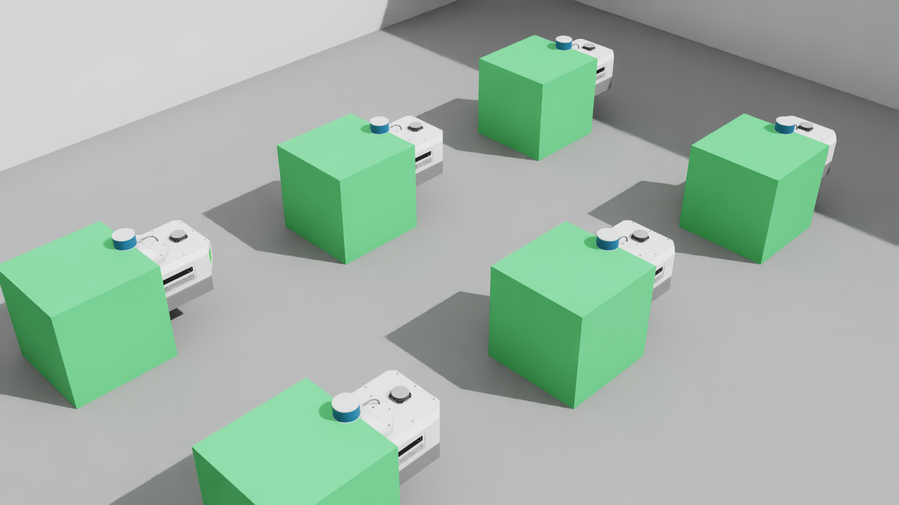
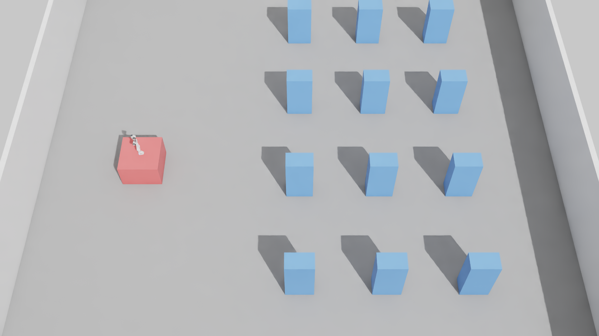
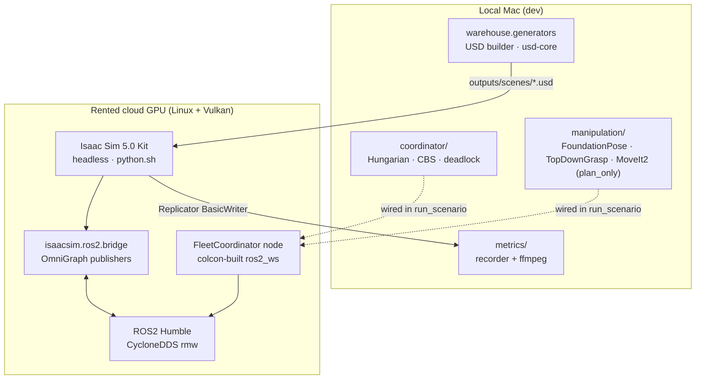

# Warehouse Digital Twin

[](https://github.com/zeon01/warehouse-digital-twin/actions/workflows/unit-tests.yml)
[](LICENSE)

> Reference implementation of the digital-twin validation pipeline used in commercial warehouse automation — same architecture KION (with Accenture / Siemens) is deploying for **GXO Logistics**, and Cyngn is using to validate autonomy before real-facility rollout.



## What's in here

| Component | Where | Status |
|-----------|-------|--------|
| Procedural warehouse builder (USD + materials + lighting) | `warehouse/` | ✅ Working — `python -m warehouse.generators.build_scene small` |
| Isaac Sim 5.0 + ROS2 bridge orchestration | `sim/`, `wdt_vast/` | ✅ Working — 6 AMRs + Franka + table + cube + camera + lighting + full TF tree |
| Fleet coordinator (Hungarian + CBS + deadlock) | `coordinator/`, `ros2_ws/src/fleet_coordinator/` | ✅ End-to-end order routing in `run_scenario.py` — enqueues, assigns, tracks AMR arrival |
| AMR navigation (pure-pursuit fallback) | `nav_drivers/`, `ros2_ws/src/wdt_pure_pursuit/` | ✅ **Phase 2 M1+M2** — single AMR drives 6m to goal in 121s; 6/6 SUCCEEDED concurrently |
| Nav2 full stack | `ros2_ws/src/wdt_nav2_bringup/` | ⚠️ Parked — DWB silent because Carter LIDAR doesn't fire under standalone-python; pure-pursuit is the production path for Phase 2 |
| MoveIt2 motion planning | `manipulation/motion_planning.py`, `ros2_ws/src/wdt_manipulation_bringup/` | ✅ **Phase 2 M3** — `plan_to_pose` succeeds in ~156ms (plan_only mode) |
| FoundationPose 6-DoF pose estimation | `manipulation/pose_estimation.py` | ✅ **Phase 2 M4** — standalone smoke green (252 candidates registered against synthetic cube) |
| End-to-end pick chain (FP + grasp + MoveIt + coordinator) | `ros2_ws/src/wdt_manipulation_bringup/wdt_manipulation_bringup/pick_cell_orchestrator.py` | 🚧 **Phase 2 M5** — redesign plan ready ([spec](docs/superpowers/specs/2026-05-16-pick-chain-redesign-design.md) · [plan](docs/superpowers/plans/2026-05-16-pick-chain-redesign.md)) |
| Metrics + video recorder | `metrics/` | ✅ Working — pytest-covered, MP4 assembler via ffmpeg |
| Scenario runner (end-to-end) | `wdt_vast/run_scenario.py`, `scenarios/` | ✅ Composes end-to-end; 64-order steady-state verified |

## What works in Phase 1 — verified

- **Procedural warehouse** generation from YAML → coloured USD scene in <2 seconds locally (`outputs/scenes/small.usd`).
- **Isaac Sim Kit boots headless** on a rented cloud GPU (RTX A5000-class with driver ≥570), opens the warehouse USD, spawns 6 namespaced Nova Carter AMRs + a Franka, renders 4 camera angles to portfolio-quality PNGs ([overhead](docs/images/scene_overhead.png), [iso](docs/images/scene_iso.png), [amrs closeup](docs/images/scene_amrs.png)).
- **ROS2 bridge** publishes 60 topics across 6 AMR namespaces (`/amr_N/cmd_vel`, `/amr_N/chassis/odom`, `/amr_N/tf`, `/amr_N/front_3d_lidar/lidar_points`, stereo cameras, 4 IMUs each).
- **Direct cmd_vel motion**: one Nova Carter moved **2.43 m** in 10 sim seconds in response to `/amr_0/cmd_vel` Twist publishes — proves bridge ↔ `differential_drive` OmniGraph ↔ wheel-joint physics chain is sound.
- **Coordinator + planner unit tests** all pass: Hungarian assignment (3 tests), CBS multi-agent path planner (2), pairwise deadlock detector (2), strategy registry (2).
- **64-order steady-state scenario** runs end-to-end on the rented A5000 in ~2 min wall-clock (10 min sim time at 5× real-time): all 64 orders enqueued at correct sim times, MetricsRecorder + events.log emitted cleanly, coordinator subprocess survives the full run.

## Visuals from the Phase 1 demo scene

| Iso (3/4 view) | AMR cluster closeup | Overhead |
|---|---|---|
|  |  |  |

## Phase 2 progress

Phase 2 closes the integration gaps from Phase 1 so a `cmd_vel`-driven demo becomes a real **AMR drives to shelf → AMR drives to pick cell → MoveIt2 plans grasp → FoundationPose registers cube** chain.

### M1 — Single-AMR navigation ✅

- Pure-pursuit driver replaces Nav2/DWB (which is silent on Carter LIDAR under standalone-python Isaac Sim)
- Carter drives 6m from `(1, 1)` to `(4.83, 4.82)` in 44.2s; `NavigateToPose` goal SUCCEEDED at tolerance 0.248m
- Action interface matches Nav2's — drop-in for `fleet_coordinator`

### M2 — Multi-AMR pure-pursuit fleet ✅

- 6 concurrent Carters driven from spawn poses to +3m diagonal goals
- 6/6 SUCCEEDED at distance 0.247–0.249m, elapsed 145.9–146.1s wall
- Confirmed sim/wall ratio ~10× slower than realtime with 6 AMRs at full RTX render on a single 3090

### M3 — MoveIt2 plan-to-pose ✅

- `wdt_manipulation_bringup/move_group.launch.py` brings up MoveIt2 via the apt-installed `moveit_resources_panda_moveit_config`
- OMPL/RRTConnect plans from `ready` pose to `ready + 0.3 rad` on `panda_joint1` in 0.02s (`plan_only=True`)
- Required: explicit `MoveItConfigsBuilder` params, self-published `/joint_states` (Panda zero-pose self-collides between `panda_link5` and `panda_link7`)

### M4 — FoundationPose standalone smoke ✅

- 8cm cube CAD + synthetic 480×640 RGB-D → `PoseEstimator.estimate()` runs the full chain
- 252 pose candidates clustered + refined via scorer (`2024-01-11-...`) + refiner (`2023-10-28-...`) weights
- Installed to system Python 3.10 (Isaac Sim's bundled 3.11 doesn't ship `rclpy`); CUDA 12.4 + nvdiffrast + pytorch3d-0.7.9
- ~12s per inference on RTX 3090

### M5 — End-to-end pick chain 🚧

- Real scene assembled: 0.6×0.6×0.7m table + 8cm cube + Isaac Sim Camera + distant + dome lighting + full TF tree (`world → cell_cam_optical`, `world → panda_link0`)
- Verified visually via the [snapshot tool](wdt_vast/snapshot_cell_cam.py) — cube clearly visible in RGB, depth shows correct geometry
- 11 iterations (v11–v21) chased layered rclpy / FoundationPose / MoveIt issues — full root-cause trail in [`docs/gotchas.md`](docs/gotchas.md) (34 documented gotchas)
- Identified root causes: **rclpy executor deadlock** in subscription callback + **FP mask too wide** (registered against table not cube) + **OrientationConstraint too tight** for top-down grasps near workspace edge
- Redesign: worker-thread orchestrator + pluggable `PoseSource` ([spec](docs/superpowers/specs/2026-05-16-pick-chain-redesign-design.md) · [10-task plan](docs/superpowers/plans/2026-05-16-pick-chain-redesign.md))
- M5 acceptance ships on `pose_source=gt` (simulator ground-truth pose); `pose_source=fp` is the M6 stretch — same orchestrator code, flag flipped

## Architecture



[Detailed design spec](docs/superpowers/specs/2026-05-14-warehouse-digital-twin-design.md) · [Full Phase 1 plan with all 48 tasks](docs/superpowers/plans/2026-05-14-warehouse-digital-twin-phase-1.md)

## Why a hybrid local + rented-GPU setup

The first attempt put the entire stack on a serverless cloud-GPU platform — it's elegant for ML workloads but **its containers can't run Isaac Sim 5.0's Vulkan stack** (verified on L4, A10G, B200 — all fail with `VkResult: ERROR_DEVICE_LOST` or `ERROR_INITIALIZATION_FAILED` despite the host having a recent NVIDIA driver and a Vulkan ICD configured). A traditional rented GPU instance (RTX A5000-class with driver ≥570) runs the same Isaac Sim image cleanly. The hybrid split:

- **Rented GPU instance**: all Isaac Sim + ROS2 + render runs (stopped between sessions to drop billing to storage-only)
- **Local Mac**: USD authoring (usd-core), pure-Python coordinator + manipulation tests, scenario YAML, render orchestration

## Run it yourself

```bash
git clone https://github.com/zeon01/warehouse-digital-twin.git
cd warehouse-digital-twin
python -m pip install -e ".[dev]"

# Build a USD scene locally — no GPU needed
python -m warehouse.generators.build_scene small
# → outputs/scenes/small.usd

# Run the pure-Python coordinator + manipulation tests
pytest tests/unit/
# → 14 passing, 2 skipped (fixtures)
```

The Isaac Sim rendering + ROS2 integration runs need a rented RTX-class GPU instance with driver ≥570; setup instructions are in [`wdt_vast/README.md`](wdt_vast/README.md).

## What's next

- **Finish M5** — execute the [pick-chain redesign plan](docs/superpowers/plans/2026-05-16-pick-chain-redesign.md) (10 TDD tasks: PoseSource protocol → PickWorker thread → orchestrator rewrite → `/world/cube_pose` publisher → fast no-sim harness → E2E smoke). Ship `orders_completed=1` on `hungarian_cbs` and tag `v0.2.0`.
- **3-config × 5-seed ablation** — run the full planner × allocator grid (`greedy_greedy`, `hungarian_greedy`, `hungarian_cbs`) on the 64-order steady_state scenario; mean ± std + p-values in `docs/results-phase-2.md`.
- **Capture the demo video** — `BasicWriter` on the overhead camera inside `run_scenario`; steady-state with `record_video: true`; stitch via `metrics.video.assemble_mp4`.
- **Phase 3 (stretch)** — wire Carter's onboard RGB-D for live FoundationPose (drop the simulator camera feed), scale to 20+ AMRs, custom-trained perception with sim-to-real ablation.

## Stack

NVIDIA Isaac Sim 5.0 · ROS2 Humble · CycloneDDS · MoveIt2 · OMPL RRTConnect · FoundationPose · pure-pursuit nav · tf2 · usd-core · pydantic · pytest · ruff

## License

MIT — see [LICENSE](LICENSE).
